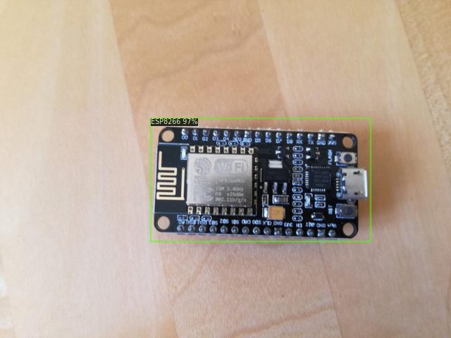

# Microcontroller Detection with Detectron2

Test

## 1. Installation

See the official [installation guide](https://github.com/facebookresearch/detectron2/blob/master/INSTALL.md).

## 2. Gathering data

Gathering data can be done the same way then for the Tensorflow Object Detection API.

To train a robust model, we need lots of pictures that should vary as much as possible from each other. That means that they should have different lighting conditions, different backgrounds and lots of random objects in them.

You can either take the pictures yourself or you can download them from the internet. For my microcontroller detector, I have four different objects I want to detect (Arduino Nano, ESP8266, Raspberry Pi 3, Heltect ESP32 Lora).

I took about 25 pictures of each individual microcontroller and 25 pictures containing multiple microcontrollers using my smartphone. After taking the pictures make sure to transform them to a resolution suitable for training (I used 800x600).

## 3. Labeling data

With all the pictures gathered, we come to the next step - labeling the data. Labeling is the process of drawing bounding boxes around the desired objects.

LabelImg is a great tool for creating a object detection data-set.

[LabelImg GitHub](https://github.com/tzutalin/labelImg)

[LabelImg Download](https://www.dropbox.com/s/tq7zfrcwl44vxan/windows_v1.6.0.zip?dl=1)

Download and install LabelImg. Then point it to your images/train and images/test directories, and draw a box around each object in each image.

LabelImg supports two formats, PascalVOC and Yolo. For this tutorial make sure to select PascalVOC. LabelImg saves a xml file containing the label data for each image.

## 4. Preparing data for training

With the images labeled, we need to prepare the data so it's easy to use it for training. In Detectron2 you can read a data-set in directly if it's in Coco format. If it's not you will need to build a custom function that returns the items in your dataset.

For more information check out the [official documentation](https://detectron2.readthedocs.io/tutorials/datasets.html#register-a-dataset).

## 5. Loading in the data and training the model

After you have your data-set prepared you are ready to start writing some code. The complete training process can be found in the [Detectron2_Detect_Microcontrollers.ipynb notebook](Detectron2_Detect_Microcontrollers.ipynb).

## 6. Using model for Inference

Now that the model is trained you can use it for inference by simply loading in the weights and config and creating a DefaultPredictor.

For a example on how to predict frames from a video or a webcam stream take a look at [detect_from_webcam_or_video.py](detect_from_webcam_or_video.py)

## Author
 **Gilbert Tanner**
